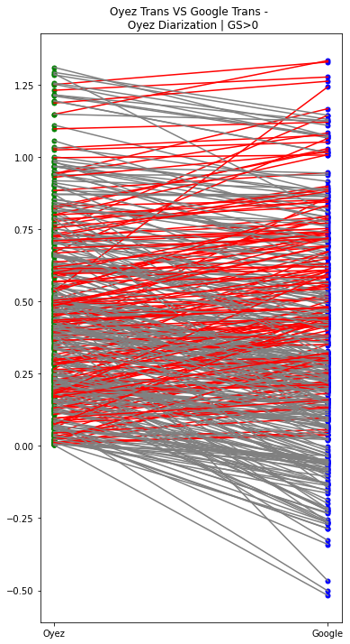
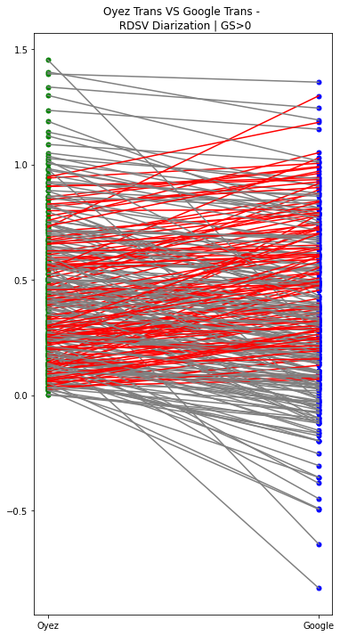

# bert4grandstand

This repository contains a BERT sequence classification model trained to estimate grandstanding in legal text. The model was fine-tuned with the dataset outlined in [When Do Politicians Grandstand](https://www.journals.uchicago.edu/doi/abs/10.1086/709147?af=R). We experiment with the model on the SCOTUS Oyez database and the audio from the Ninth Circuit Court. We use the gold standard audio transcriptions as well as transcriptions from Google and IBM Speech-to-Text API's. We also use the gold standard diarization and audio diarized with our own diarization method found [here](https://github.com/JeffT13/rd-diarization), which is present as a submodule of this repo. We are currently exploring the application of this process on the Ninth Circuit Court. 

## Grandstanding score per segment comparison

### Gold Transcript vs Google API on Gold Diarization

### Gold Transcript vs Google API on RDSV Diarization

